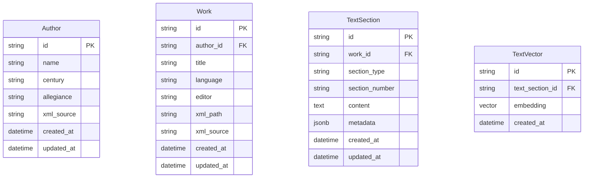

# First1KGreek Database Integration Plan

This plan outlines how to integrate a database layer into the First1KGreek project while maintaining XML files as the scholarly source of truth.

## Database Design Principles

1. **XML Remains Source of Truth** - All database entities link back to source XML
2. **Efficient Querying** - Optimize for common query patterns
3. **Schema Evolution** - Support evolving the schema without data loss
4. **Vector Integration** - Design with vector search capabilities in mind

## Database Schema

### Core Entities



### Relationships

* **Author** has many **Works**
* **Work** has many **TextSections**
* **TextSection** has one **TextVector**

## Implementation Strategy

### 1. Database Setup

```python
# src/first1k/db/models.py
from sqlalchemy import Column, String, Text, DateTime, ForeignKey, JSON
from sqlalchemy.ext.declarative import declarative_base
from sqlalchemy.orm import relationship
from sqlalchemy.dialects.postgresql import JSONB, VECTOR

Base = declarative_base()

class Author(Base):
    __tablename__ = "authors"
    
    id = Column(String, primary_key=True)
    name = Column(String, nullable=False)
    century = Column(String)
    allegiance = Column(String)
    xml_source = Column(Text)
    created_at = Column(DateTime)
    updated_at = Column(DateTime)
    
    works = relationship("Work", back_populates="author")


class Work(Base):
    __tablename__ = "works"
    
    id = Column(String, primary_key=True)
    author_id = Column(String, ForeignKey("authors.id"), nullable=False)
    title = Column(String, nullable=False)
    language = Column(String)
    editor = Column(String)
    xml_path = Column(String)
    xml_source = Column(Text)
    created_at = Column(DateTime)
    updated_at = Column(DateTime)
    
    author = relationship("Author", back_populates="works")
    sections = relationship("TextSection", back_populates="work")


class TextSection(Base):
    __tablename__ = "text_sections"
    
    id = Column(String, primary_key=True)
    work_id = Column(String, ForeignKey("works.id"), nullable=False)
    section_type = Column(String)
    section_number = Column(String)
    content = Column(Text, nullable=False)
    metadata = Column(JSONB)
    created_at = Column(DateTime)
    updated_at = Column(DateTime)
    
    work = relationship("Work", back_populates="sections")
    vector = relationship("TextVector", uselist=False, back_populates="section")


class TextVector(Base):
    __tablename__ = "text_vectors"
    
    id = Column(String, primary_key=True)
    text_section_id = Column(String, ForeignKey("text_sections.id"), nullable=False)
    embedding = Column(VECTOR(1536))  # For OpenAI embeddings
    created_at = Column(DateTime)
    
    section = relationship("TextSection", back_populates="vector")
```

### 2. Database Connection

```python
# src/first1k/db/connection.py
from sqlalchemy import create_engine
from sqlalchemy.orm import sessionmaker

from ..config import DATABASE_URL

engine = create_engine(DATABASE_URL)
Session = sessionmaker(bind=engine)

def get_session():
    """Get a database session."""
    return Session()
```

### 3. Import Pipeline

```python
# src/first1k/import_export/database_importer.py
import datetime
import uuid
from ..xml_utils.processor import extract_fragments, extract_metadata
from ..db.models import Author, Work, TextSection
from ..db.connection import get_session

def import_xml_to_db(xml_path):
    """Import XML file to database."""
    with open(xml_path, 'r', encoding='utf-8') as f:
        xml_content = f.read()
    
    # Extract metadata and content
    metadata = extract_metadata(xml_content)
    fragments = extract_fragments(xml_content)
    
    # Create database session
    session = get_session()
    
    # Create or update author
    author = session.query(Author).filter_by(id=metadata['author_id']).first()
    if not author:
        author = Author(
            id=metadata['author_id'],
            name=metadata['author_name'],
            century=metadata.get('century'),
            created_at=datetime.datetime.now(),
            updated_at=datetime.datetime.now()
        )
        session.add(author)
    
    # Create or update work
    work = session.query(Work).filter_by(id=metadata['work_id']).first()
    if not work:
        work = Work(
            id=metadata['work_id'],
            author_id=metadata['author_id'],
            title=metadata['title'],
            language=metadata.get('language', 'grc'),
            editor=metadata.get('editor'),
            xml_path=xml_path,
            created_at=datetime.datetime.now(),
            updated_at=datetime.datetime.now()
        )
        session.add(work)
    else:
        work.updated_at = datetime.datetime.now()
    
    # Create text sections
    for fragment in fragments:
        section = TextSection(
            id=str(uuid.uuid4()),
            work_id=metadata['work_id'],
            section_type=fragment['type'],
            section_number=fragment['number'],
            content=fragment['content'],
            metadata=fragment.get('metadata', {}),
            created_at=datetime.datetime.now(),
            updated_at=datetime.datetime.now()
        )
        session.add(section)
    
    # Commit changes
    session.commit()
```

### 4. Add Vector Embeddings

```python
# src/first1k/embeddings/generator.py
import datetime
import uuid
import openai
from ..db.models import TextSection, TextVector
from ..db.connection import get_session

def generate_embeddings_for_section(section_id, model="text-embedding-3-small"):
    """Generate embeddings for a text section."""
    session = get_session()
    section = session.query(TextSection).filter_by(id=section_id).first()
    
    if not section:
        raise ValueError(f"Section {section_id} not found")
    
    # Generate embedding
    response = openai.Embedding.create(
        input=section.content,
        model=model
    )
    embedding = response['data'][0]['embedding']
    
    # Create or update vector
    vector = session.query(TextVector).filter_by(text_section_id=section_id).first()
    if not vector:
        vector = TextVector(
            id=str(uuid.uuid4()),
            text_section_id=section_id,
            embedding=embedding,
            created_at=datetime.datetime.now()
        )
        session.add(vector)
    else:
        vector.embedding = embedding
        vector.created_at = datetime.datetime.now()
    
    session.commit()
    return vector.id
```

### 5. Database-Backed API

```python
# src/first1k/handlers/api.py
from ..db.connection import get_session
from ..db.models import Author, Work, TextSection

def get_authors():
    """Get all authors from database."""
    session = get_session()
    return session.query(Author).all()

def get_author(author_id):
    """Get author by ID."""
    session = get_session()
    return session.query(Author).filter_by(id=author_id).first()

def get_works_by_author(author_id):
    """Get works by author ID."""
    session = get_session()
    return session.query(Work).filter_by(author_id=author_id).all()

def get_work(work_id):
    """Get work by ID."""
    session = get_session()
    return session.query(Work).filter_by(id=work_id).first()

def get_sections_by_work(work_id):
    """Get text sections by work ID."""
    session = get_session()
    return session.query(TextSection).filter_by(work_id=work_id).all()
```

### 6. Vector Search

```python
# src/first1k/search/vector_search.py
import openai
from sqlalchemy import func
from ..db.connection import get_session
from ..db.models import TextVector, TextSection, Work, Author

def search_by_vector(query, limit=10, model="text-embedding-3-small"):
    """Search text sections by vector similarity."""
    # Generate query embedding
    response = openai.Embedding.create(
        input=query,
        model=model
    )
    query_embedding = response['data'][0]['embedding']
    
    # Search database
    session = get_session()
    
    # PostgreSQL vector similarity search (requires pgvector extension)
    results = (
        session.query(
            TextSection,
            Work,
            Author,
            func.cosine_similarity(TextVector.embedding, query_embedding).label("similarity")
        )
        .join(TextVector, TextVector.text_section_id == TextSection.id)
        .join(Work, Work.id == TextSection.work_id)
        .join(Author, Author.id == Work.author_id)
        .order_by(func.cosine_similarity(TextVector.embedding, query_embedding).desc())
        .limit(limit)
        .all()
    )
    
    return results
```

## Migration Strategy

1. **Create Database Schema** - Set up tables and indexes
2. **Implement Importers** - Create XML to database importers
3. **Migrate Existing Data** - Populate database from XML files
4. **Generate Embeddings** - Create vector embeddings for text
5. **Add Database Queries** - Replace file-based queries with database queries
6. **Maintain XML Sync** - Ensure database stays in sync with XML files

## Benefits

1. **Faster Queries** - Optimized database lookups instead of file scanning
2. **Advanced Search** - Vector similarity and full-text search capabilities
3. **Structured Data** - Well-defined schema with proper relationships
4. **Metadata Enrichment** - Additional metadata can be stored in the database
5. **XML Preservation** - Original XML sources remain untouched

## Technical Requirements

1. **PostgreSQL Database** - With pgvector extension for vector operations
2. **SQLAlchemy ORM** - For database interaction
3. **OpenAI API** - For generating embeddings
4. **Alembic** - For database migrations
5. **Connection Pooling** - For efficient database connections

## Future Extensions

1. **Full-Text Search** - Add PostgreSQL full-text search capabilities
2. **Versioning** - Track changes to text sections over time
3. **User Annotations** - Allow user annotations on text sections
4. **Collaborative Editing** - Enable collaborative editing workflows
5. **Custom Metadata** - Support user-defined metadata fields
